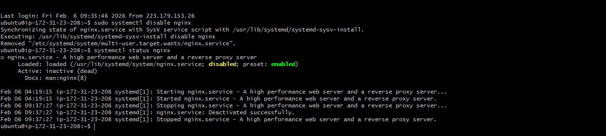

# Day 05 – Linux Troubleshooting Drill: CPU, Memory, and Logs

- Target service / process : **Nginx**
1. _systemctl status nginx_ : Show the status of nginx service, weather it's working  active or it is inactive.
2. _systemctl disable nginx_ : disable service.
3. _systemctl enable nginx_ : enable service.
4. _systemctl is-enable nginx_ : shows current status of service.
5. _systemctl stop nginx_ : deactivate the service.
6. _sytemctl start nginx_ : activate the service.
7. _sytemctl restart nginx_ : first deactivate and then activates the service.

 - In the clip below where you find enabled(green) it indicates acc. to system defination present policy, the ngnix service is intended to be enabled by default. 
 - Disabled(yellow) : it denotes the service it disabled with some intention by the user, so tht jus after rebooting of system it does not restart again.If service is done stop last time when system was on.
 - Active : inactive show the service is not working right now . otherwise it would have shown Active : running (live)

- **Environment basics :**
    1. _uname -a_: Shows the kernel version, system architecture, and basic OS info.
    2. *lsb_release -a* : Displays Ubuntu distribution details like version, codename, and description.
    3. _cat /etc/os-release_ : Prints OS identification info (name, version, ID) from the system file.

  

- **Filesystem sanity :**

_throwaway folder and file_(temporary file and folder) : A temporary file, also known as a temp file or foo file, is a file created to hold information temporarily while a file is being created or modified. These files are deleted once the program is closed and are used to manage data storage, recover lost data, and manage multiple users. Temporary files are typically named with extensions like .tmp, .temp, or other variations depending on the program or operating system that created them. They are stored in a temporary directory, which can be found in the AppData folder on Windows or in the /tmp directory on Unix-like systems.

    1. _mkdir /tmp/runbook-demo_ : Creates a temporary directory to verify filesystem write access.
    2. _cp /etc/hosts /tmp/runbook-demo/hosts-copy_ : Copies a known system file to confirm file read/write works correctly.
    3. _ls -l /tmp/runbook-demo_ : Lists files with permissions, ownership, and size to verify creation.

  

- **CPU / Memory :** 
1. _top_ : Shows real-time CPU, memory usage, and running processes.

   

2. _htop_ : An interactive, user-friendly version of top with process tree and colors.
  

3. _ps -o pid,pcpu,pmem,comm -p <pid>_ : Displays CPU %, memory %, and command name for a specific process ID.
  
   

4. _free -h_ : Shows total, used, and free memory in human-readable units.
  
   

- **Disk / IO :** 
1. _df -h_ : Shows disk space usage for all mounted filesystems.
2. du -sh /var/log_ : Displays the total disk space used by /var/log.
3. _iostat_ : Reports CPU usage and disk I/O statistics.
4. _vmstat_ : Shows memory, swap, CPU, and I/O activity over time.
5. _dstat_ : Provides real-time system resource statistics (CPU, disk, network).
   
   

- **Network :** 
1. _sudo ss -tulpn_: Lists listening TCP/UDP ports and the processes using them.
2. _sudo netstat -tulpn_ : Legacy alternative to ss showing open ports and associated processes.
3. _curl -I <service-endpoint>_ : Fetches HTTP response headers to check service availability.
4. _ping <host>_ : Tests network connectivity and latency to a host.
   

- **Logs :** 
1. _journalctl -u <service> -n 50_ : Shows the last 50 log entries for a systemd service.
   
   

2. _tail -n 50 /var/log/<file>.log_ : Displays the most recent 50 lines from a log file.
   
