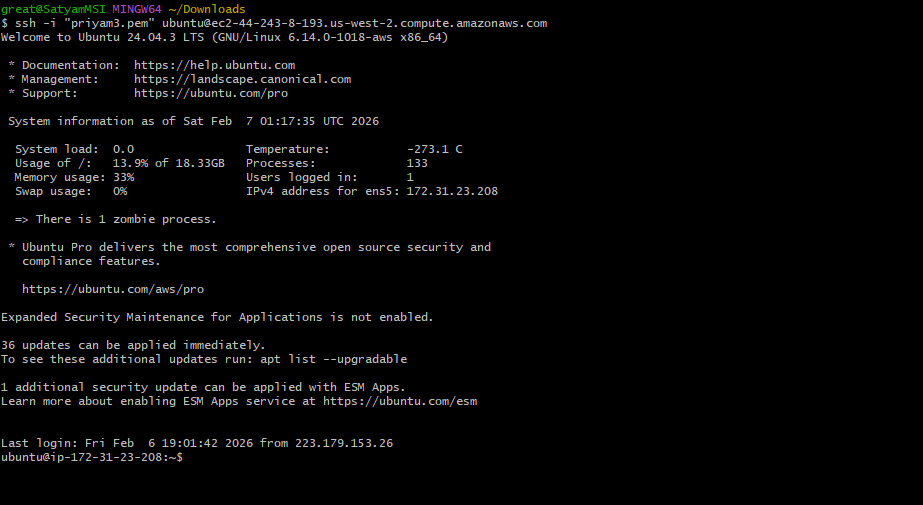
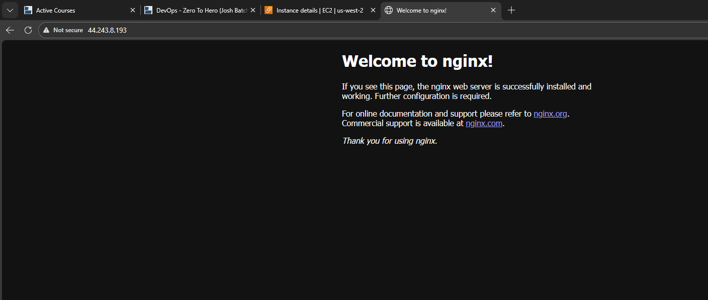
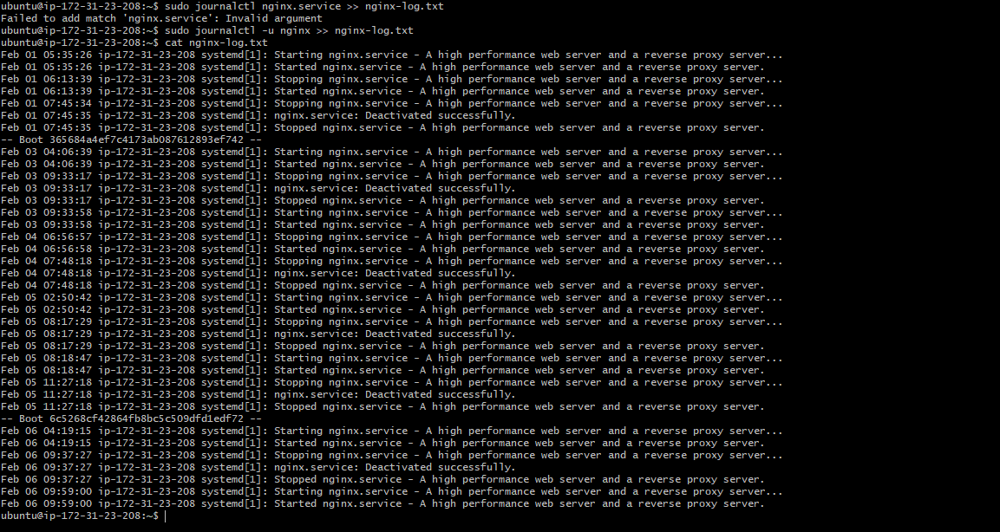
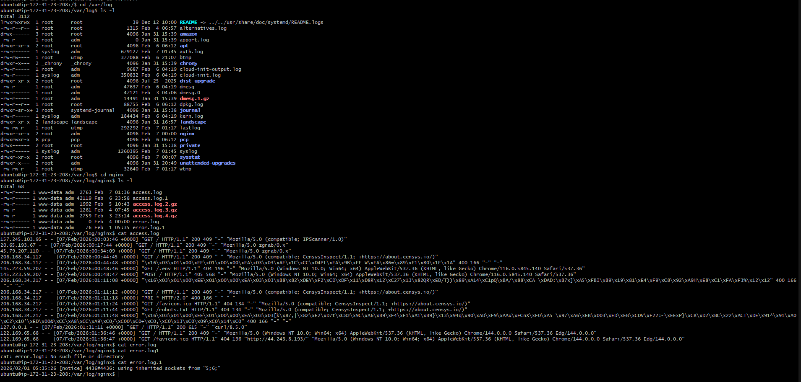

2. Screenshots showing:
   - SSH connection to your server
   - use sudo apt update
   - use sudo apt install nginx
   - sudo systemct status nginx
   - sudo journalctl -u nginx >> nginx-logs.txt # to save log in a txt file.

   

   - Nginx welcome page accessible from browser
   

   - Log file contents

3. The log file: `nginx-logs.txt`

