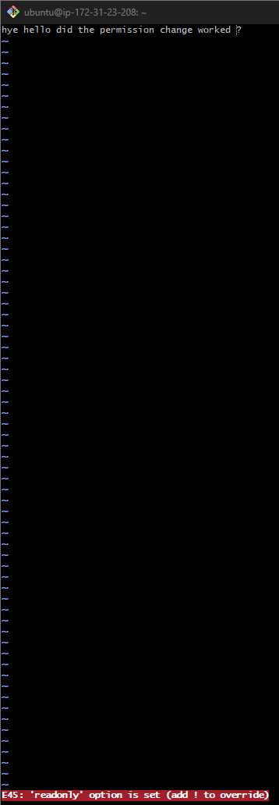
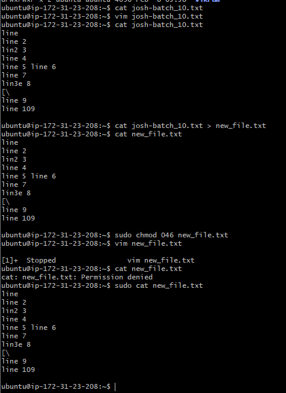
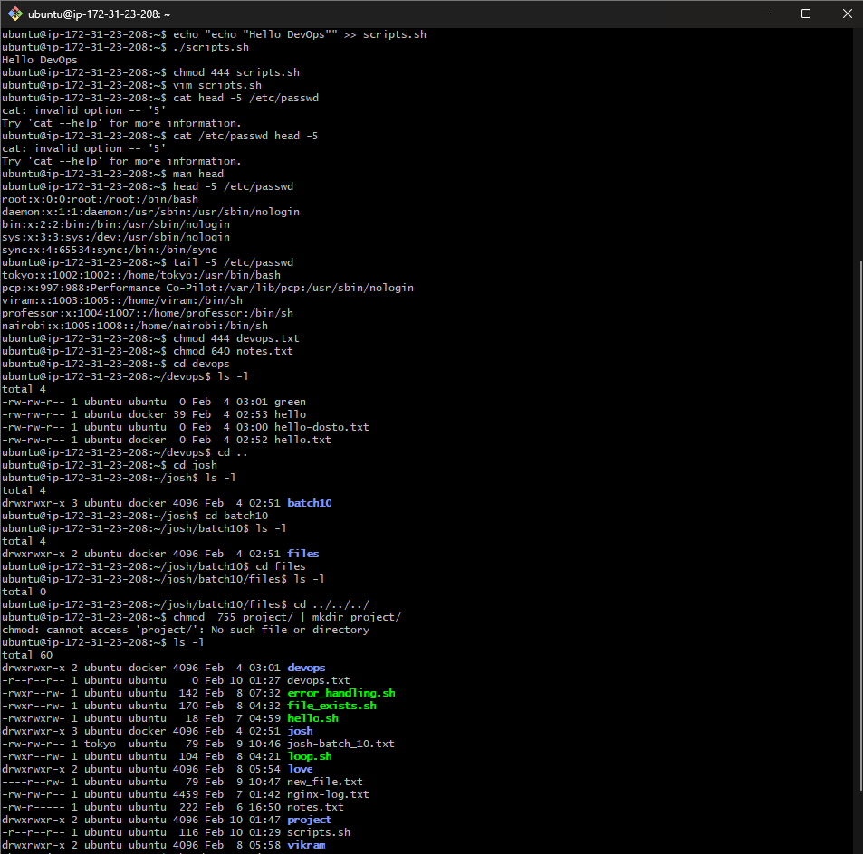
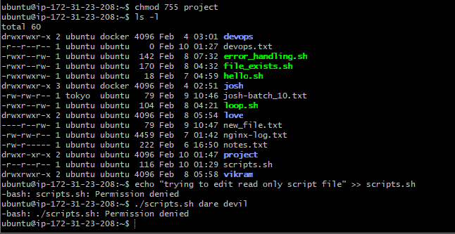

I  created a file josh_batch_10.txt using "touch" edited using "vim" verified using "cat" redirected its result to a new_file.txt using "cat josh_batch_10.txt >> nex_file.txt" , edited its permision using "sudo chmod 046 new_file.txt" , veified using "vim new_file.txt" 

