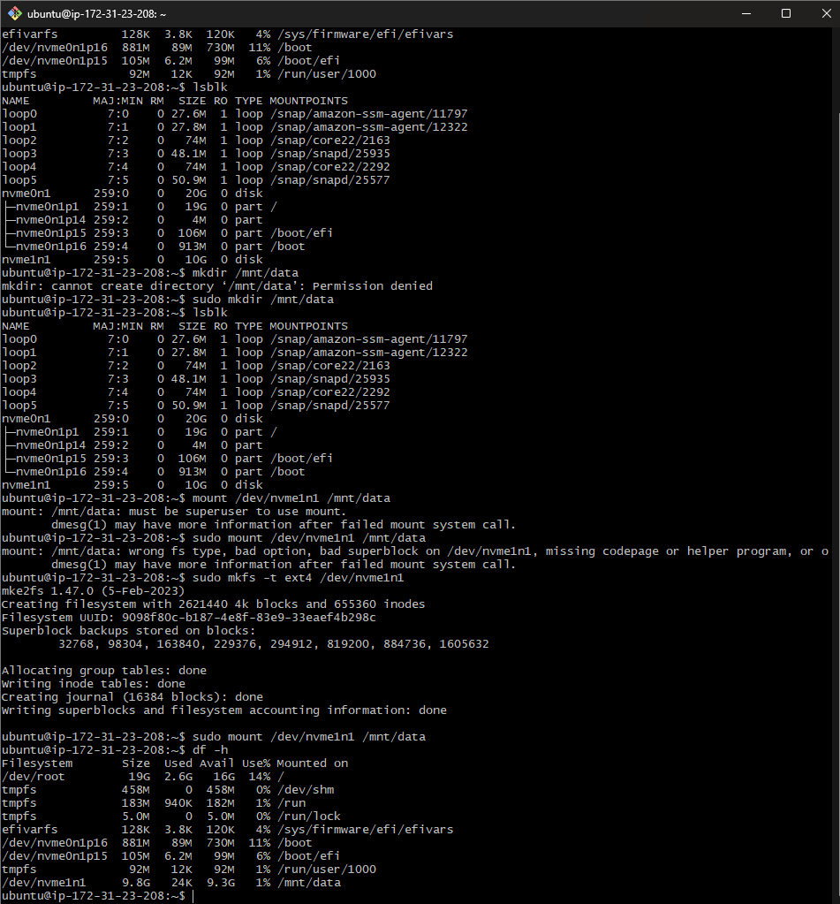
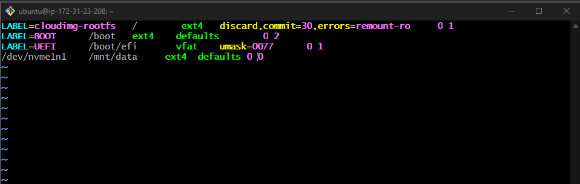
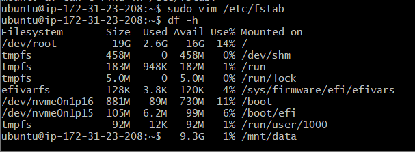
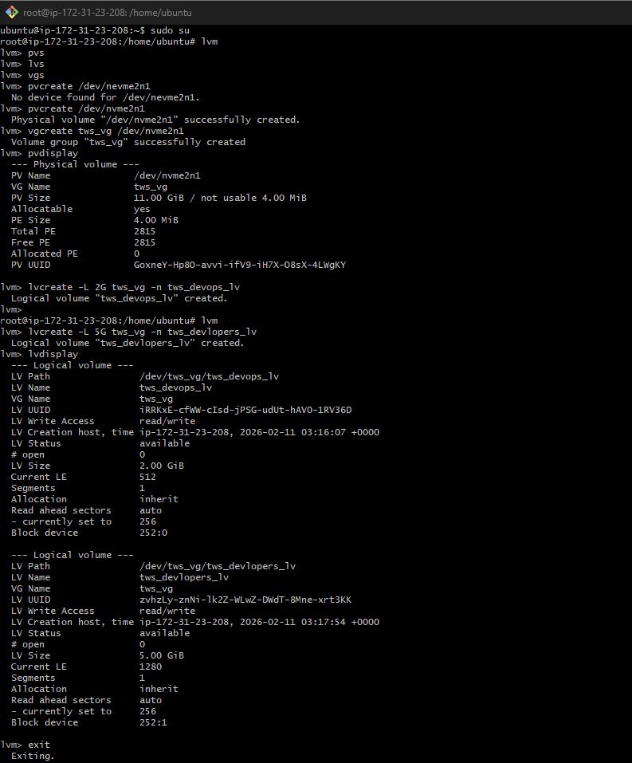
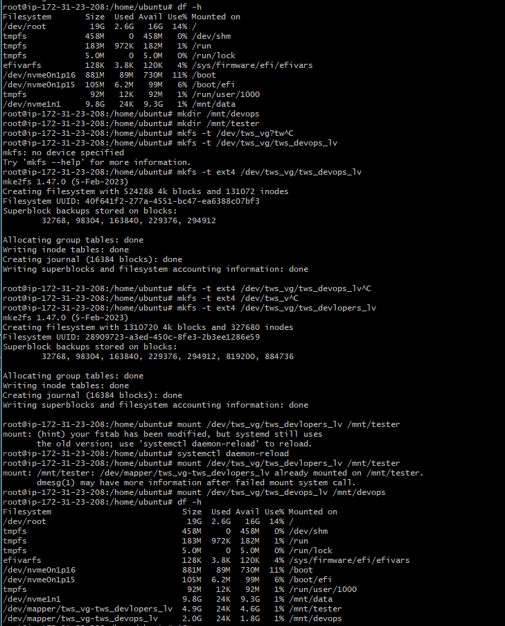

EC2--EBS (Elastic blocks Storage)--volume 10 GiB--(ensure both volume and and your instance should be of same availability zone)--Attach to the instance with whic you want to use.

On sever -> running " df -h " will not show the attach volume as its not mounted yet.

lsblk : is command to list all attached blocks , the loops you see are for aws internal storage and backups.

nvme1n1 : (new drivers, nitro based) is a volume attached by us on the instance

how to do mounting ?
mount : mounting 
umount : unmounting
sudo su : to become root
mkdir/data : can be done but its not good practice to alter the pre dir given by aws
so we do,
sudo mkdir /mnt/data : best practice to add mounts in mount

> sudo mount /dev/nvme1n1 /mnt/data :
faces error, wrong fs

now need to format /mnt/data with particular file system

> man mkfs -t
ext4 is the standard file system in linux
> sudo mkfs -t ext4 /dev/nvme1n1
> sudo mount /dev/nvme1n1 /mnt/data

usage : A backup volume
day quiz 1---

>vim /etc/fstab
/dev/nvme1n1  /mnt/data   ext4 defaults  0 0

usage : it will be mount whenever server will reboot

Traditional -----^^^^^^^

modern devops -----
10 G vol -> 5G (x) 2(y)  3(z)

logical Volumes -> logical volume manager (LVM)

crate new vol

Disk -->Physical volume --> Volume group ---> logical Volume 

> man lvm : The Logical Volume Manager (LVM) provides tools to create virtual block devices from physical devices.

pvs : physical volumes
lvs : logical volumes
vgs : volume groups

----lvm----
pvcreate
vgcreate
lvdisplay
lvcreate -L 2G tws_vg -n tws_devops_lv
lvcreate -L 5G tws_vg -n tws_devlopers_lv
lvdisplay
exit

------lvm------

df -h  : not show created lv
lsblk : shows created lvm

mkdir /mnt/dvops
mkdir /mnt/testers

mkfs -t ext4 /dev/tws_vg/tws_devops_lv
mkfs -t ext4 /dev/tws_vg/tws_devlopers_lv

mount /dev/tws_vg/tws_devops_lv /mnt/dvops
mount /dev/tws_vg/tws_devlopers_lv /mnt/testers

df -h : npw show created lvm

