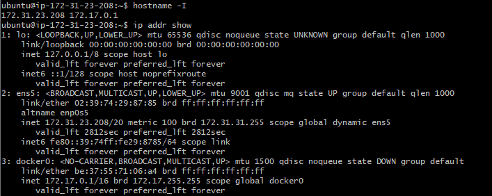
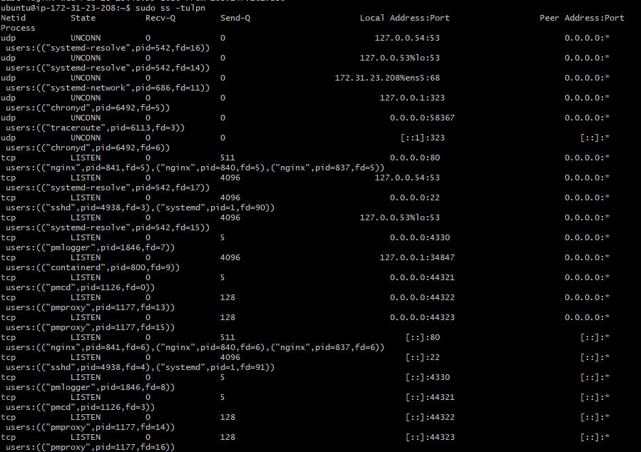
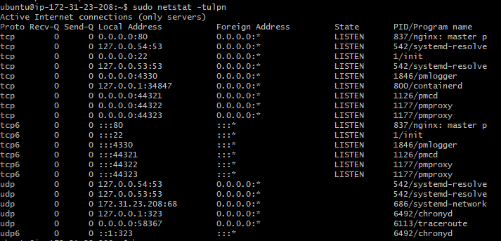
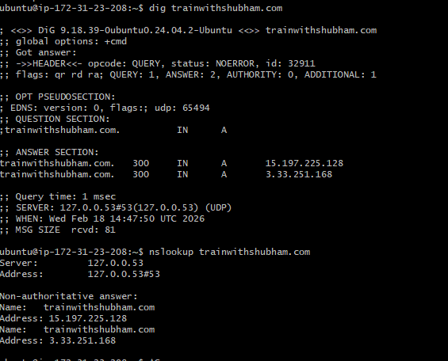

| OSI Layer       | TCP/IP Layer   | PDU                            | Addressing / Control                       | Protocol Examples                     | Devices                 |
| --------------- | -------------- | ------------------------------ | ------------------------------------------ | ------------------------------------- | ----------------------- |
| 7. Application  | Application    | Data                           | Application-specific fields                | HTTP, HTTPS, FTP, SMTP, DNS, SSH      | PC, Server              |
| 6. Presentation | Application    | Data                           | Encryption, Encoding, Compression          | TLS/SSL, JPEG, PNG, ASCII             | PC, Server              |
| 5. Session      | Application    | Data                           | Session Control / Checkpoints              | NetBIOS Session, RPC                  | PC, Server              |
| 4. Transport    | Transport      | _Segment (TCP)/Datagram (UDP)_ | **Port Numbers (Src/Dst)**                 | TCP, UDP                              | Firewall, Load Balancer |
| 3. Network      | Internet       | Packet                         | **IP Address (Src/Dst)** + Protocol Number | IPv4, IPv6, ICMP                      | Router, L3 Switch       |
| 2. Data Link    | Network Access | Frame                          | **MAC Address (Src/Dst)**                  | Ethernet (802.3), Wi-Fi (802.11), PPP | Switch, Bridge, NIC     |
| 1. Physical     | Network Access | Bits                           | Signaling (Voltage, Light, RF)             | UTP, Fiber, Radio                     | Hub, Repeater, Cables   |
 
 
https://app.eraser.io/workspace/2XrkypMwAGykC89IgjPI : Agentic AI

# Run essential connectivity commands

`hostname -I`  &&  `ip addr show`

sudo ss -tulpn &&  sudo netstat -tulpn
 

## _Nginx is listening at port 80_

nslookup trainwithshubham.com
dig trainwithshubham.com 

- Which command gives you the fastest signal when something is broken?
curl -I <https:// srvice name or ip:port >
curl -v <https:// srvice name or ip:port >

why ? , because
Tests DNS resolution
Tests TCP connectivity
Tests HTTP response
Shows status codes immediately

_One command → checks multiple layers._

and you can also use 

| Command                  | What It Quickly Tells You            |
| ------------------------ | ------------------------------------ |
| `ping host`              | Basic network reachability (Layer 3) |
| `ss -tulnp`              | Is service listening on port?        |
| `systemctl status nginx` | Is service running?                  |
| `journalctl -xe`         | Immediate system errors              |
| `top` / `htop`           | CPU / memory spike                   |
| `df -h`                  | Disk full (very common cause!)       |

- What layer (OSI/TCP-IP) would you inspect next if DNS fails? If HTTP 500 shows up?

DNS is:
    OSI Layer 7 (Application)
    Runs over UDP/TCP (Layer 4)
    Uses IP (Layer 3)

Investigation order:
    Application layer (DNS config)
    Transport (UDP 53 blocked?)
    Network (routing issue?)

Linux checks:
    cat /etc/resolv.conf
    dig google.com
    nslookup google.com

1. If dig fails → DNS issue
2. If ping 8.8.8.8 works but ping google.com fails → definitely DNS

🔹 If HTTP 500 Shows Up
HTTP 500 = Server-side error.

This is:
OSI Layer 7 (Application Layer)
    NOT network.
    NOT transport.
    NOT firewall.

It means:
Request reached the server successfully, but application failed.

Next layer to inspect:
Application + Backend service

Linux checks:
    journalctl -u nginx
    journalctl -u apache2
    tail -f /var/log/nginx/error.log

If using backend (Node, Python, Java):
    ps aux | grep node
    systemctl status app-service

- Two follow-up checks you’d run in a real incident.

Let’s say production is down.

✅ Check #1 — Is the service running?
systemctl status <service-name>
ss -tulnp | grep 80

Confirms:

Process exists

Port is open

✅ Check #2 — Is system resource exhausted?

Most real outages are:

Disk full

Memory full

CPU 100%

Run:

df -h
free -m
top

If disk is 100% → services crash → 500 errors

Very common in production.

🔥 Real Incident Troubleshooting Flow (Senior-Level Answer)

curl the service
Check HTTP code
    If DNS fails → check resolv.conf
    If connection refused → check service + port
    If 500 → check app logs

Check CPU, memory, disk
Check firewall (iptables -L or ufw status)

🔎 Strong Interview Summary Answer
If asked verbally:

I start with curl because it validates DNS, TCP, and HTTP in one step.
If DNS fails, I investigate at Layer 7 (Application) but verify transport and network connectivity.
If HTTP 500 appears, I move directly to application logs and backend service health.
In real incidents, I always verify service status and system resources immediately.

